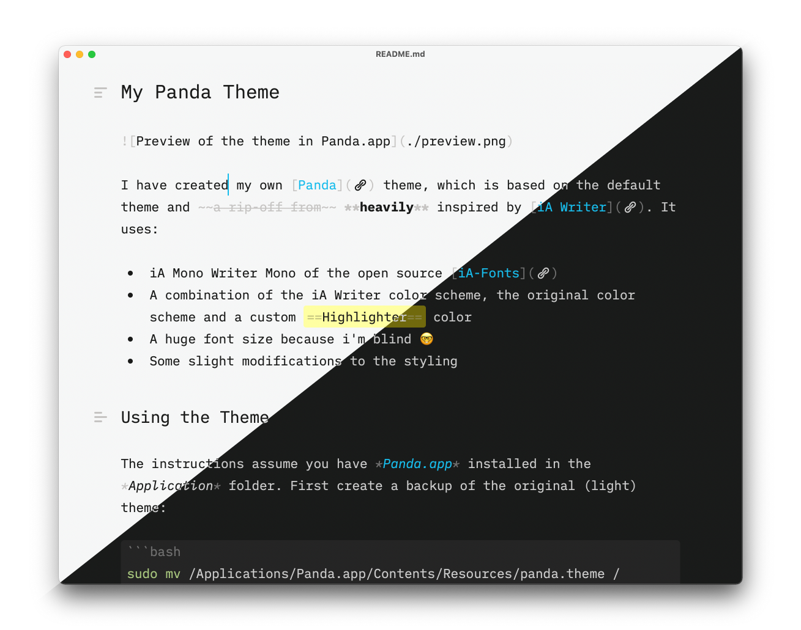

# My Panda Theme



I have created my own [Panda](https://bear.app/alpha/) theme, which is based on the default theme and ~~a rip-off from~~ **heavily** inspired by [iA Writer](https://ia.net/writer). It uses:

- iA Mono Writer Mono of the open source [iA-Fonts](https://github.com/iaolo/iA-Fonts)
- A combination of the iA Writer color scheme, the original color scheme and a custom ==Highlighter== color
- A huge font size because i'm blind 🤓
- Some slight modifications to the styling

## Using the Theme

The instructions assume you have *Panda.app* installed in the *Application* folder and the [iA-Fonts](https://github.com/iaolo/iA-Fonts) active. First create a backup of the original themes:

```bash
sudo mv /Applications/Panda.app/Contents/Resources/panda.theme /Applications/Panda.app/Contents/Resources/panda.theme.bak
sudo mv /Applications/Panda.app/Contents/Resources/panda.theme /Applications/Panda.app/Contents/Resources/dark.theme.bak
```

Subsequently copy (linking the files doesn't seam to work) the custom themes into the app bundle

```bash
sudo cp path/to/repo/panda.theme /Applications/Panda.app/Contents/Resources/panda.theme
sudo cp path/to/repo/dark.theme /Applications/Panda.app/Contents/Resources/dark.theme
```

Since Panda has (to the best of my knowledge) no official support for themes, updating the app will overwrite the copied custom themes.
